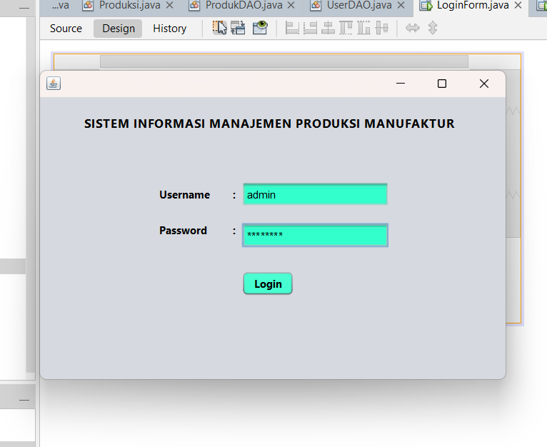
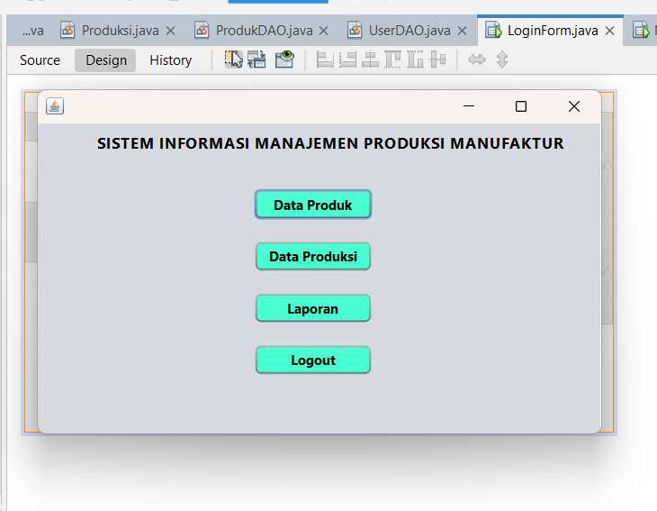
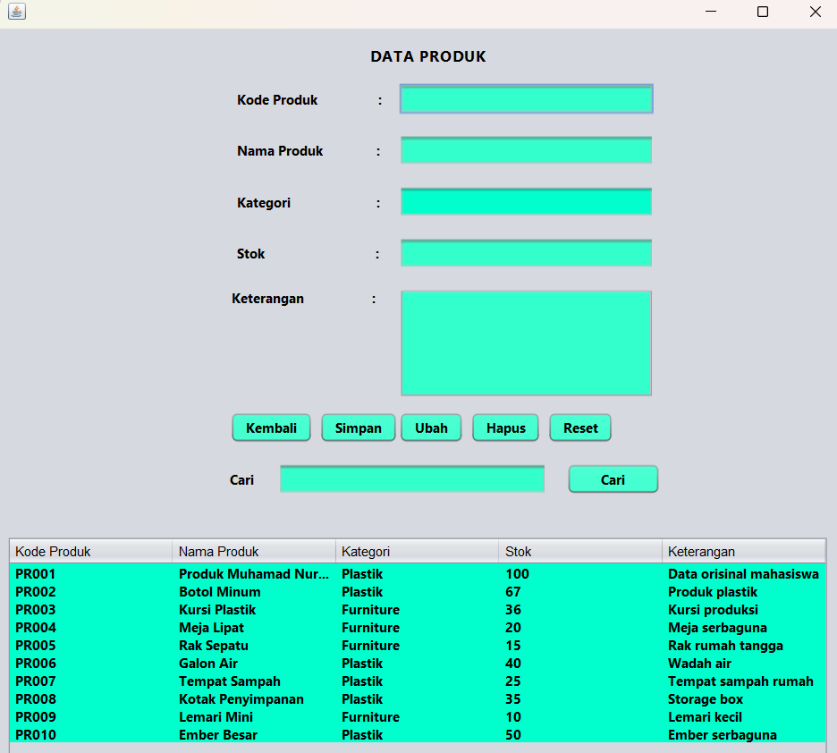
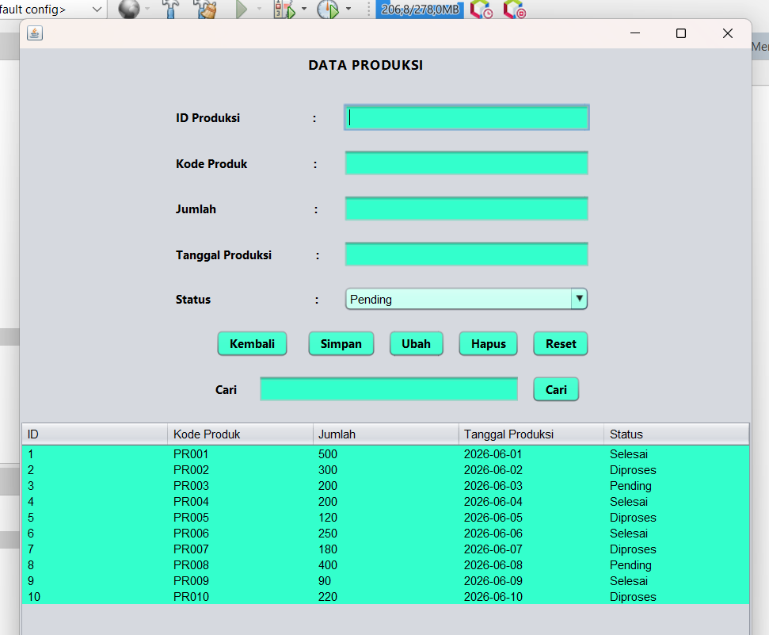
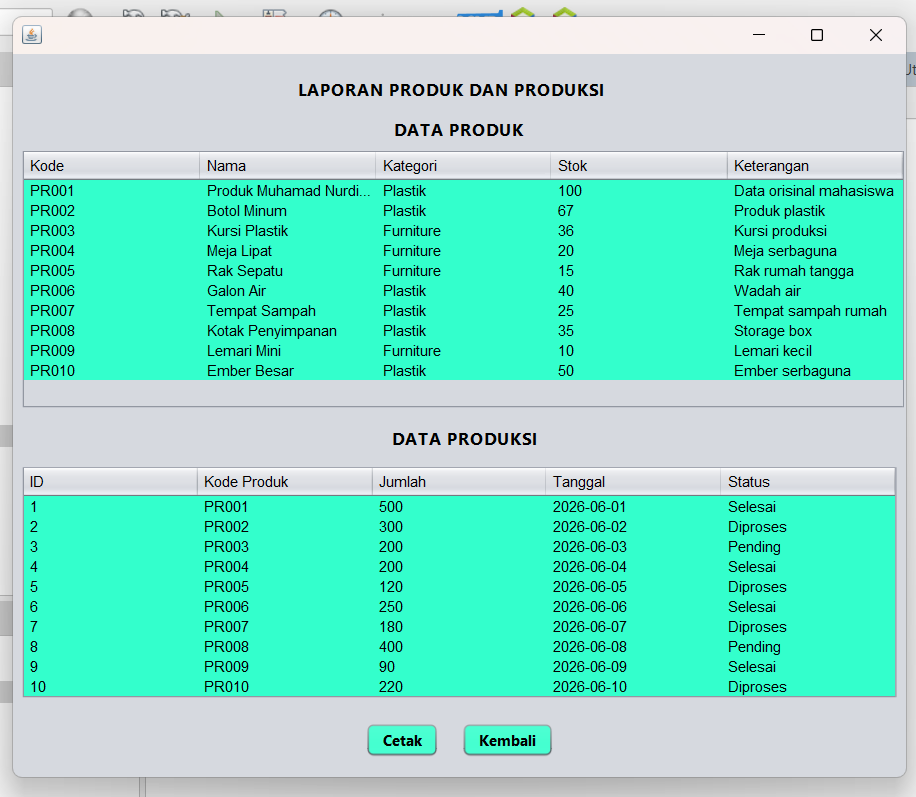

# Sistem Informasi Manajemen Produksi Manufaktur

## Identitas Mahasiswa

* **Nama:** Muhamad Nurdin
* **NIM:** 231011400249
* **Mata Kuliah:** Pemrograman II
* **Project Akhir:** Sistem Informasi Manajemen Produksi Manufaktur

---

## Deskripsi Project

Sistem Informasi Manajemen Produksi Manufaktur merupakan aplikasi desktop berbasis **Java Swing** yang dirancang untuk membantu pengelolaan data produk dan data produksi pada perusahaan manufaktur. Aplikasi ini menerapkan konsep **CRUD (Create, Read, Update, Delete)**, **Object-Oriented Programming (OOP)**, **Model View Controller (MVC)**, **Data Access Object (DAO)**, serta **Java Database Connectivity (JDBC)** untuk mengelola dan mengakses data secara terstruktur. Selain itu, aplikasi juga dilengkapi dengan fitur pencarian data, pembuatan laporan, dan pencetakan laporan sehingga dapat membantu proses pengelolaan produksi menjadi lebih efektif dan efisien.

---

## Fitur

* Login User
* Menu Utama
* CRUD Data Produk
* CRUD Data Produksi
* Pencarian Data Produk
* Pencarian Data Produksi
* Laporan Data Produk
* Laporan Data Produksi
* Cetak Laporan
* Logout

---

## Teknologi

* Java
* Java Swing
* MySQL
* JDBC (Java Database Connectivity)
* MVC (Model View Controller)
* DAO (Data Access Object)
* Apache NetBeans IDE

---

## Database

File database yang digunakan pada aplikasi ini terdapat pada:

```text
db_manufaktur_231011400249.sql
```

Import file tersebut ke dalam **MySQL** sebelum menjalankan aplikasi.

---

## Cara Menjalankan

1. Import file database `db_manufaktur_231011400249.sql` ke MySQL.
2. Buka project menggunakan **Apache NetBeans IDE**.
3. Pastikan konfigurasi koneksi database pada file `KoneksiDB.java` telah sesuai.
4. Jalankan aplikasi melalui file `LoginForm.java`.
5. Login menggunakan akun yang tersedia pada database.

---

## Screenshot

### Login



### Menu Utama



### Data Produk



### Data Produksi



### Laporan



---

## Struktur Project

```text
Manufaktur_231011400249
│
├── lib
├── nbproject
├── screenshots
├── src
│   ├── config
│   ├── dao
│   ├── model
│   └── view
├── .gitignore
├── build.xml
├── db_manufaktur_231011400249.sql
├── manifest.mf
└── README.md
```

## Konsep yang Digunakan

- Object Oriented Programming (OOP)
- Model View Controller (MVC)
- Data Access Object (DAO)
- Java Database Connectivity (JDBC)
---

## Author

**Muhamad Nurdin**
**NIM:** 231011400249

---

## License

Project ini dibuat untuk memenuhi tugas akhir Mata Kuliah Pemrograman II.
